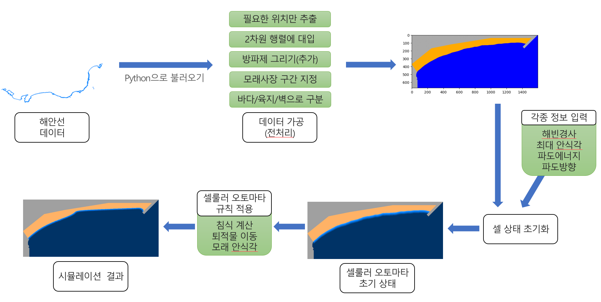

# coastline-erosion-predict
셀룰러 오토마타 기법을 이용한 해안침식 시뮬레이터

# Data
해양수산부 - 연안포털 - 2020년도 현황도/관리도
- [access link](https://coast.mof.go.kr/coastKnowledge/coastDatumView.do?dt3=&seq=7669&data_type=3&page=1)
- `samples/shapefile/`에 저장되어 있습니다.

# Sample
Google Colab [<노트북 링크>](https://colab.research.google.com/drive/1KCdx7AwZugM3dHrnFoCa9UPhvUK_ykDE?usp=sharing)에서 예시 코드를 실행해볼 수 있습니다.

